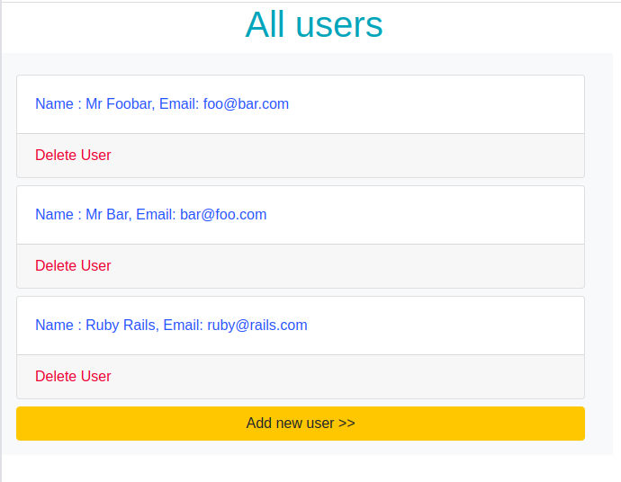
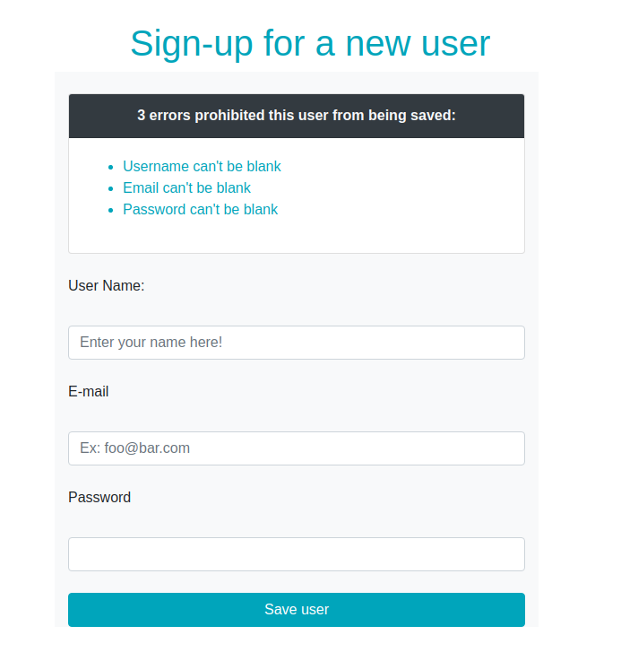
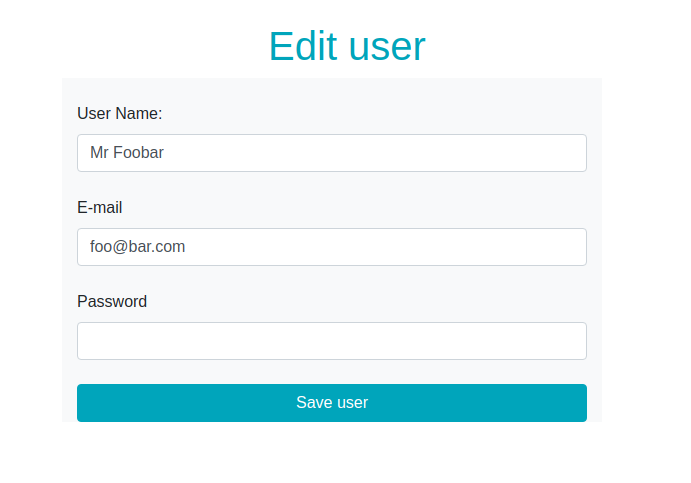

# Building Forms with Ruby on Rails

This is a part of the Forms Project in The Odin Project’s Ruby on Rails Curriculum. Find it at http://www.theodinproject.com
The objectif of this exercise is to build a User model with the functionalities of creating, editing, deleting and displaying.

## Built with:

Framework/API : ``Ruby on Rails``
Langage: ``Ruby``
Styling: ``Bootstrap 4``
Text-editor: Visual Studio Code

## Getting started

To get a local copy of the repository please run the following commands on your terminal:

```
$ git clone git@github.com:CalyCherkaoui/re-former.git
$ cd reformer
$ git checkout development
$ bundle install
$ yarn install --check-files
$ rails db:migrate
$ rails server
```
In your browser's adress field, type : http://localhost:3000


# Models

The models created:
```
User:
  -Name:string
  -Email:string
  -Password:string
```
## Demo

After cloning the repo into you local machine and cd to re-form folder, run the rails server your terminal ```rails server```

### Displaying all users
Link to the view: <http://localhost:3000/users>



### Adding a user
Link to the view: <http://localhost:3000/users/new>



### Editing a user
Link to the view: <>http://localhost:3000/users/:id/edit>



## Author

👤 **Houda Cherkaoui**

- Github: [@CalyCherkaoui](https://github.com/CalyCherkaoui)
- Twitter: [@Houda59579688](https://twitter.com/Houda59579688)
- Linkedin: [Houda-Cherkaoui](https://www.linkedin.com/in/houda-cherkaoui-64106395/)


## 🤝 Contributing

Contributions, issues and feature requests are welcome!

## Show your support

Give a ⭐️ if you like this project!

## Acknowledgments

- Hat tip to anyone whose code was used
- Inspiration
- Microverse
- The Odin Project

## 📝 License

This project is [MIT]() licensed.